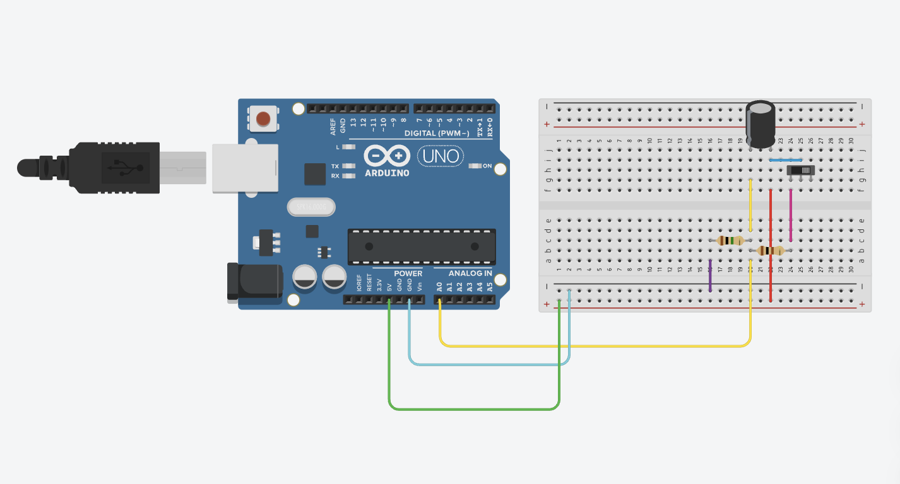
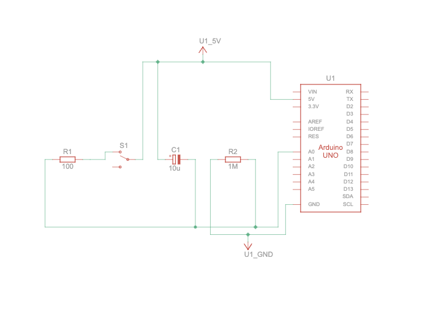

# Atividade Ponderada – Circuito RC

  

*Circuito feito por Giorgia Scherer*

## Um pouco mais sobre a atividade
Esta atividade consiste na montagem de um **circuito RC** (Resistor + Capacitor) utilizando o **Arduino** para monitoramento das tensões nos componentes. A atividade teve como objetivo **coletar dados experimentais** e gerar gráficos mostrando o comportamento da tensão ao longo do tempo durante os processos de **carga e descarga**.

O experimento permite compreender como a energia elétrica é armazenada e liberada por um capacitor, além de analisar a resposta do resistor associado ao circuito.

## Objetivos
- Observar o comportamento de um **capacitor durante a carga e descarga**.
- Medir a **tensão no capacitor e no resistor** ao longo do tempo.
- Gerar gráficos para **visualizar a transferência de energia** no circuito RC.
- Comparar os resultados obtidos com o **comportamento teórico** esperado.

## Ferramentas Utilizadas
- [Confira o Circuito RC com o Arduino no Tinkercad](https://www.tinkercad.com/things/9OyvEtcHVm2-atividade-ponderada-da-instrucao-semana-2/editel?returnTo=%2Fthings%2F9OyvEtcHVm2-atividade-ponderada-da-instrucao-semana-2&sharecode=fdCRoNtnIOGjPvks3lrNfJToxLTrNvBMnuVd28fzcu4)
- Python (para geração de gráficos)
- Matplotlib (biblioteca de plotagem em Python)

## Como Funciona?
O **Arduino** lê continuamente a tensão nos terminais do capacitor e do resistor, enviando os valores para o **Monitor Serial**. Esses dados são posteriormente processados no Python, onde são gerados os gráficos que mostram:

1. **Carga do Capacitor:** tensão decrescendo de 5V para 0V.
2. **Descarga no Resistor:** tensão crescente de 0V para 5V.
3. **Comparação entre Carga e Descarga:** cruzamento das curvas, evidenciando a transferência de energia no circuito.

## Resultados

*Vista Esquemática*

Confira os resultados no notebook [aqui](Sensores-e-Atuadores-Basicos-Circuito-RC/ponderada.ipynb)

## Conclusão
O experimento reforça a compreensão do **comportamento de circuitos RC** e demonstra a relação entre corrente, tensão e tempo. Ele confirma que a tensão no capacitor e no resistor estão inversamente relacionadas, como previsto pela teoria.  

---

> ⚡ Este projeto foi realizado como atividade prática para a **Semana 2 de Experimentos com Circuitos RC**.
